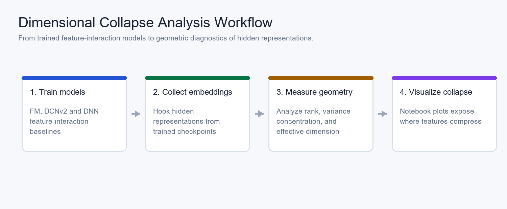
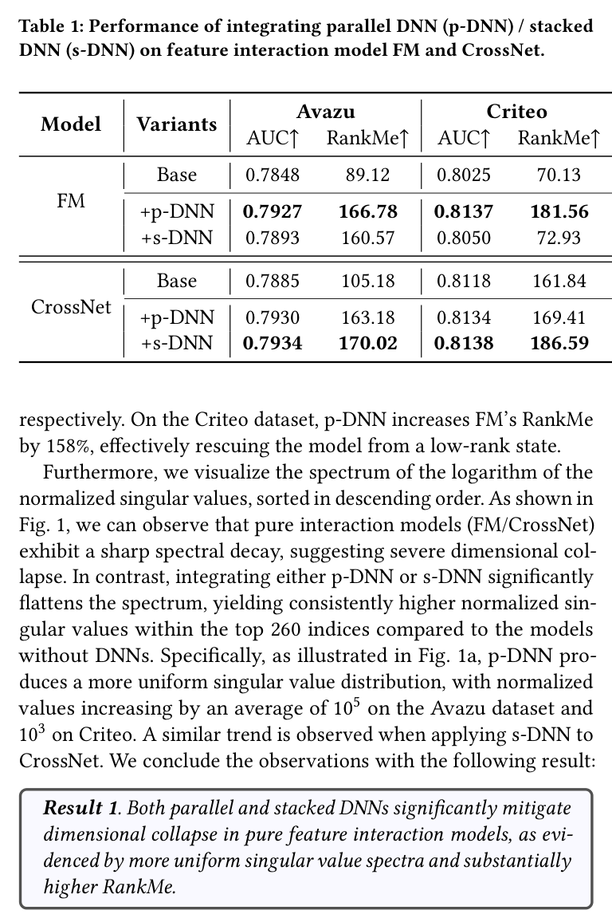

# Understanding DNNs in Feature Interaction Models: A Dimensional Collapse Perspective

[](https://ustc-starteam.github.io/Dimensional-Collapse-Analysis/)
[](https://arxiv.org/abs/2604.26489)
[](https://arxiv.org/abs/2604.26489)
[](https://www.python.org/)

Official code for **"Understanding DNNs in Feature Interaction Models: A Dimensional Collapse Perspective"**.

This repository analyzes how DNN components affect representation geometry in feature interaction models. It is implemented on top of [FuxiCTR](https://github.com/reczoo/FuxiCTR) and reuses experiment conventions from [GE4Rec](https://github.com/USTC-StarTeam/GE4Rec).

## 1. Paper

Jiancheng Wang, Mingjia Yin, Hao Wang, and Enhong Chen. **Understanding DNNs in Feature Interaction Models: A Dimensional Collapse Perspective.** SIGIR 2026 Short Paper, 2026.

[Paper](https://arxiv.org/abs/2604.26489) / [PDF](https://arxiv.org/pdf/2604.26489) / [Project Page](https://ustc-starteam.github.io/Dimensional-Collapse-Analysis/) / [Code](https://github.com/USTC-StarTeam/Dimensional-Collapse-Analysis) / [Citation](#citation)

The paper studies a long-running question in feature interaction models: whether DNNs mainly learn high-order interactions or instead improve the dimensional robustness of learned representations. It analyzes dimensional collapse through trained embeddings, component ablations, and gradient-based evidence.

## 2. Highlights

- Studies DNN roles in feature interaction models from a **dimensional collapse** perspective.
- Supports analysis over complete DNNs and fine-grained DNN components.
- Provides scripts to prepare data, train models, extract embeddings, and visualize collapse behavior.
- Builds on FuxiCTR and GE4Rec so the analysis remains close to established CTR/recommendation workflows.

## 3. Method At A Glance



The workflow trains feature interaction models, extracts hidden embeddings, measures geometric collapse, and visualizes the resulting representation patterns in `analysis.ipynb`.

## 4. Repository Structure

```text
.
|-- fuxictr/              # FuxiCTR-based training and utility code
|-- model_zoo/            # Feature interaction model configurations and runners
|-- 1.prepare.sh          # Data/model preparation
|-- 2.train_model.sh      # Model training
|-- 3.analyze.sh          # Embedding extraction for collapse analysis
|-- analyze.py            # Analysis data generation
|-- analysis.ipynb        # Visualization and interpretation notebook
`-- docs/                 # Project page and README assets
```

## 5. Installation

```bash
conda create -n FuxiCTR_analysis python=3.10 -y
conda activate FuxiCTR_analysis
pip3 install torch torchvision torchaudio
pip3 install -r requirements.txt
```

## 6. Data / Models

Prepare the dataset and train the feature interaction models:

```bash
bash 1.prepare.sh
bash 2.train_model.sh
```

## 7. Quick Start

Generate embedding batches for dimensional collapse analysis:

```bash
bash 3.analyze.sh
```

After embeddings are generated, open `analysis.ipynb` and set `embedding_dir` to the generated file path.

## 8. Reproducing Results / Evaluation

The notebook visualizes embedding statistics and collapse patterns after the training and extraction scripts finish. Advanced usage and lower-level code explanations follow the conventions in [GE4Rec](https://github.com/USTC-StarTeam/GE4Rec).

## 9. Configuration Notes

The model zoo inherits FuxiCTR-style configuration. When adding new models, keep the preparation, training, extraction, and notebook paths aligned so the analysis notebook can reuse the same embedding layout.

## 10. Experimental Highlights



This table from the experiments section reports how parallel and stacked DNNs change AUC and RankMe on FM/CrossNet, making the dimensional-collapse conclusion visible before the shortened takeaway table.


The paper reports that both parallel and stacked DNN components can mitigate dimensional collapse in embeddings, giving a different explanation for why DNNs help feature interaction models beyond directly learning dot products.

| Backbone | Dataset | Base AUC / RankMe | With DNN | Readout |
| --- | --- | --- | --- | --- |
| FM | Avazu | 0.7848 / 89.12 | +p-DNN: 0.7927 / 166.78; +s-DNN: 0.7893 / 160.57 | Both DNN placements raise AUC and RankMe. |
| FM | Criteo | 0.8025 / 70.13 | +p-DNN: 0.8137 / 181.56; +s-DNN: 0.8050 / 72.93 | p-DNN increases FM RankMe by about 158%. |
| CrossNet | Avazu | 0.7885 / 105.18 | +p-DNN: 0.7930 / 163.18; +s-DNN: 0.7934 / 170.02 | DNNs flatten the singular-value spectrum. |
| CrossNet | Criteo | 0.8118 / 161.84 | +p-DNN: 0.8134 / 169.41; +s-DNN: 0.8138 / 186.59 | Stacked DNN gives the strongest RankMe in this setting. |

**Conclusion:** DNN components help feature-interaction models partly by improving embedding dimensional robustness, not only by adding more nonlinear predictors.

## 11. Notes For Maintainers

- Keep generated embeddings and large data artifacts outside Git history.
- Store future README/project-page visuals under `docs/assets/`.
- Add proceedings, slides, or video links to the Paper section when official SIGIR materials become public.

<a id="citation"></a>

## 12. Citation

```bibtex
@misc{wang2026dimensionalcollapse,
  title = {Understanding DNNs in Feature Interaction Models: A Dimensional Collapse Perspective},
  author = {Wang, Jiancheng and Yin, Mingjia and Wang, Hao and Chen, Enhong},
  year = {2026},
  eprint = {2604.26489},
  archivePrefix = {arXiv},
  primaryClass = {cs.LG},
  url = {https://arxiv.org/abs/2604.26489}
}
```

## 13. Contact

For paper questions, please contact:

- First author: Jiancheng Wang (`wangjc830@mail.ustc.edu.cn`)
- Corresponding authors: Hao Wang (`wanghao3@ustc.edu.cn`) and Enhong Chen (`cheneh@ustc.edu.cn`)

For repository issues, please open a GitHub issue in this repository.
